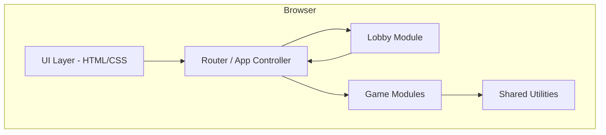
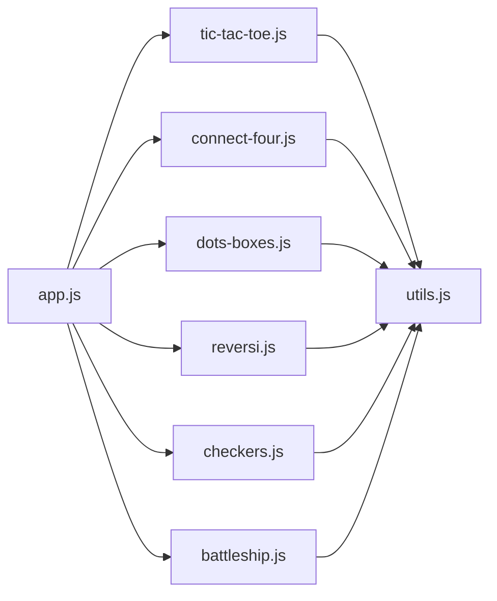
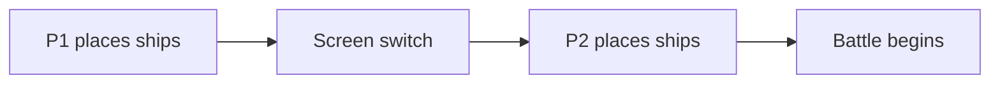
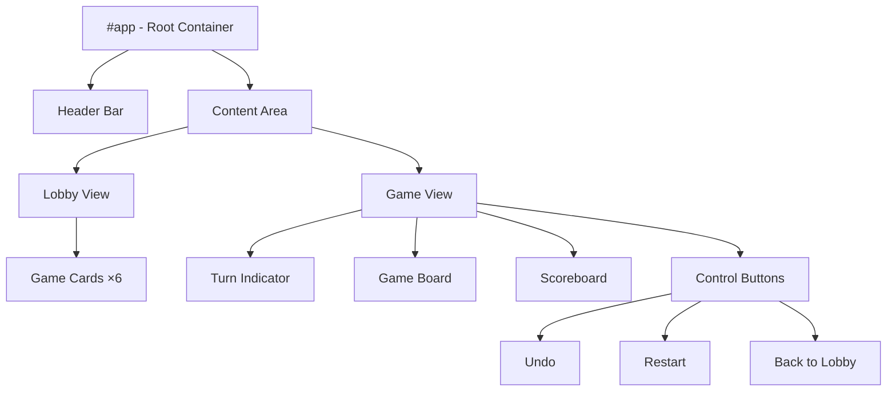
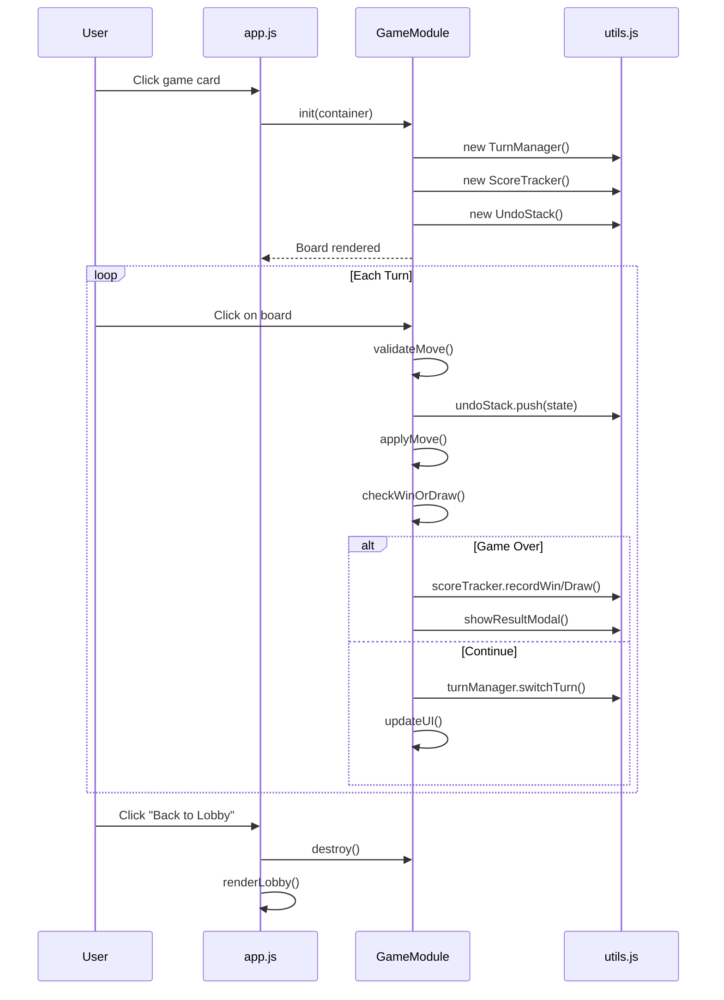
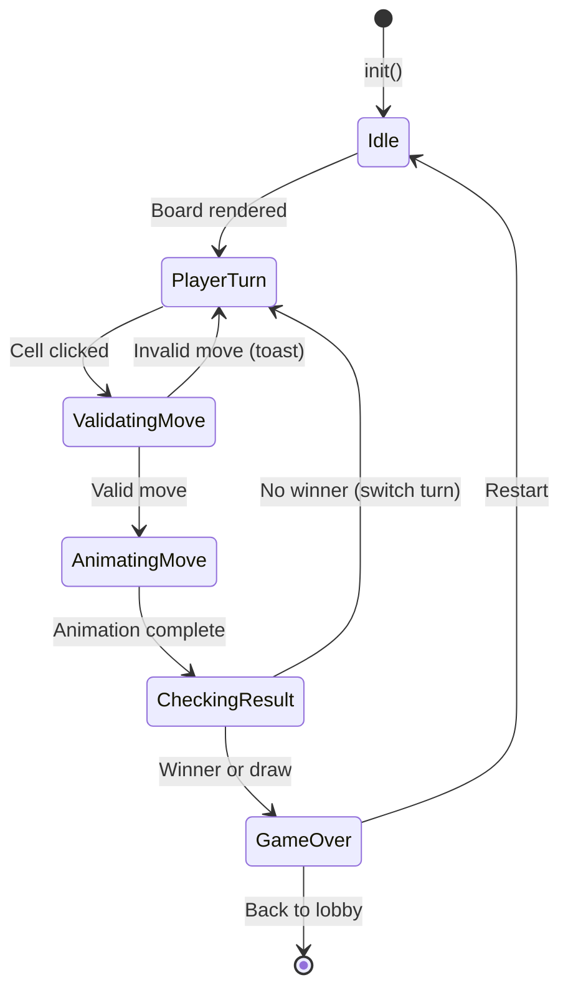

# Software Design Document (SDD)
## Two-Player Games Website

**Version:** 1.0  
**Date:** March 3, 2026  
**Author:** Tanvi Kandoi  
**Reference:** [SRS.md](file:///Users/tanvikandoi/Desktop/project/game/SRS.md)

---

## 1. Introduction

### 1.1 Purpose
This document describes the detailed software design for the Two-Player Games Website as specified in the SRS. It covers the system architecture, module decomposition, data structures, algorithms, UI component design, and inter-module communication.

### 1.2 Scope
The design covers all 6 games (Tic Tac Toe, Connect Four, Dots and Boxes, Reversi, Checkers, Battleship), the game lobby, shared utilities, and the styling system. The application is a single-page, client-side web application using vanilla HTML, CSS, and JavaScript.

---

## 2. System Architecture

### 2.1 High-Level Architecture



### 2.2 Architectural Style
- **Pattern:** Single-Page Application (SPA) with hash-based routing
- **Rendering:** DOM manipulation via JavaScript (no virtual DOM)
- **State Management:** Each game module owns its own state; shared utilities manage cross-cutting concerns (scores, turns, undo)

### 2.3 Directory Structure

```
game/
├── index.html              # Single HTML entry point
├── css/
│   └── styles.css          # Global design system + game-specific styles
├── js/
│   ├── app.js              # SPA router, lobby rendering, page transitions
│   ├── utils.js            # Shared: score tracker, turn manager, undo stack
│   └── games/
│       ├── tic-tac-toe.js  # Tic Tac Toe game module
│       ├── connect-four.js # Connect Four game module
│       ├── dots-boxes.js   # Dots and Boxes game module
│       ├── reversi.js      # Reversi (Othello) game module
│       ├── checkers.js     # Checkers game module
│       └── battleship.js   # Battleship game module
├── assets/
│   └── images/             # Game thumbnails & icons
├── SRS.md
└── SDD.md
```

---

## 3. Module Design

### 3.1 Module Overview



---

### 3.2 `app.js` — Router & Lobby Controller

**Responsibilities:**
- Hash-based SPA routing (`#/`, `#/tic-tac-toe`, etc.)
- Render the game lobby (card grid)
- Load/unload game modules on navigation
- Manage page transitions and animations

**Key Functions:**

| Function | Description |
|----------|-------------|
| `init()` | Set up event listeners, render lobby, listen for `hashchange` |
| `navigate(route)` | Parse hash, destroy current game, initialize target game |
| `renderLobby()` | Build and insert the game card grid into the DOM |
| `showRulesModal(gameId)` | Display rules overlay for a specific game |

**Routing Table:**

| Hash | Module | Action |
|------|--------|--------|
| `#/` | — | Render lobby |
| `#/tic-tac-toe` | `tic-tac-toe.js` | `TicTacToe.init()` |
| `#/connect-four` | `connect-four.js` | `ConnectFour.init()` |
| `#/dots-boxes` | `dots-boxes.js` | `DotsBoxes.init()` |
| `#/reversi` | `reversi.js` | `Reversi.init()` |
| `#/checkers` | `checkers.js` | `Checkers.init()` |
| `#/battleship` | `battleship.js` | `Battleship.init()` |

---

### 3.3 `utils.js` — Shared Utilities

**Responsibilities:**
- Turn management
- Score tracking across rounds
- Undo stack management
- Common UI helpers (modals, toasts)

**Classes / Objects:**

#### `TurnManager`
```javascript
class TurnManager {
    constructor(players = ['Player 1', 'Player 2'])
    getCurrentPlayer()    // Returns current player name
    getPlayerIndex()      // Returns 0 or 1
    switchTurn()          // Alternates to the other player
    reset()               // Reset to Player 1
}
```

#### `ScoreTracker`
```javascript
class ScoreTracker {
    constructor(gameId)
    getScores()           // Returns { p1: number, p2: number, draws: number }
    recordWin(playerIdx)  // Increment win count for player
    recordDraw()          // Increment draw count
    reset()               // Reset all scores to 0
}
```

#### `UndoStack`
```javascript
class UndoStack {
    constructor(maxDepth = 50)
    push(state)           // Save a game state snapshot
    pop()                 // Return and remove last snapshot
    canUndo()             // Check if undo is available
    clear()               // Empty the stack
}
```

#### UI Helpers
```javascript
function showResultModal({ winner, scores, onRestart, onLobby })
function showToast(message, duration = 2000)
function createButton(text, onClick, className)
```

---

### 3.4 Game Module Interface

Every game module **must** export the following standardized interface:

```javascript
const GameModule = {
    init(container)       // Mount the game into the given DOM container
    destroy()             // Clean up event listeners, timers, DOM nodes
    restart()             // Reset game state for a new round (preserve scores)
    undo()                // Revert the last move using UndoStack
    getState()            // Return current game state (for debugging)
}
```

---

### 3.5 Game-Specific Designs

#### 3.5.1 Tic Tac Toe

**State:**
```javascript
{
    board: Array(9),          // null | 'X' | 'O'
    currentPlayer: 0 | 1,
    gameOver: boolean,
    winner: null | 0 | 1,
    winningCells: []          // Indices of winning combination
}
```

**Win Detection Algorithm:**
- Check 8 winning lines (3 rows, 3 columns, 2 diagonals)
- After each move, check only lines passing through the last-placed cell

**Winning Lines:**
```
[0,1,2], [3,4,5], [6,7,8],  // Rows
[0,3,6], [1,4,7], [2,5,8],  // Columns
[0,4,8], [2,4,6]             // Diagonals
```

---

#### 3.5.2 Connect Four

**State:**
```javascript
{
    board: Array(6).fill(Array(7)),  // 6 rows × 7 cols, null | 0 | 1
    currentPlayer: 0 | 1,
    gameOver: boolean,
    winner: null | 0 | 1,
    winningCells: []
}
```

**Key Algorithms:**

| Algorithm | Description |
|-----------|-------------|
| **Drop Disc** | Scan column bottom-to-top, place disc in first empty row |
| **Win Check** | From last placed disc, check 4 directions (horizontal, vertical, 2 diagonals) for 4 consecutive same-color discs |
| **Drop Animation** | CSS `@keyframes` for disc falling from top of column to target row |

**Win Detection (directional scan):**
```
For each of 4 directions: horizontal, vertical, diagonal-left, diagonal-right
    Count consecutive same-color discs in both directions from last placed
    If count >= 4 → winner found
```

---

#### 3.5.3 Dots and Boxes

**State:**
```javascript
{
    rows: 4, cols: 4,               // 5×5 dots = 4×4 boxes
    horizontalLines: Array(5×4),    // Boolean: line drawn or not
    verticalLines: Array(4×5),      // Boolean: line drawn or not
    boxes: Array(4×4),              // null | 0 | 1 (owner)
    currentPlayer: 0 | 1,
    scores: [0, 0]
}
```

**Key Algorithms:**

| Algorithm | Description |
|-----------|-------------|
| **Line Click** | Toggle a line; check if it completes any adjacent box(es) |
| **Box Completion** | A box is complete when all 4 surrounding lines are drawn |
| **Extra Turn** | If a box is completed, the current player gets another turn |
| **End Game** | All boxes filled → player with most boxes wins |

**Line-to-Box mapping:** Each line borders at most 2 boxes. On click, check those 1–2 boxes for completion.

---

#### 3.5.4 Reversi (Othello)

**State:**
```javascript
{
    board: Array(8×8),        // null | 0 (Black) | 1 (White)
    currentPlayer: 0 | 1,
    validMoves: [],           // Array of [row, col] for current player
    gameOver: boolean,
    scores: [0, 0]            // Disc counts
}
```

**Key Algorithms:**

| Algorithm | Description |
|-----------|-------------|
| **Valid Move Finder** | For each empty cell, scan 8 directions; a move is valid if it would flip at least 1 opponent disc |
| **Flip Discs** | After placing, traverse all 8 directions and flip opponent discs until reaching own disc or edge |
| **Pass Turn** | If no valid moves for current player, auto-pass; if neither player can move → game over |
| **Scoring** | Count all discs of each color on the board |

**Direction vectors:** `[(-1,-1), (-1,0), (-1,1), (0,-1), (0,1), (1,-1), (1,0), (1,1)]`

---

#### 3.5.5 Checkers

**State:**
```javascript
{
    board: Array(8×8),        // null | { player: 0|1, isKing: boolean }
    currentPlayer: 0 | 1,
    selectedPiece: null | { row, col },
    validMoves: [],
    mustCapture: boolean,     // Force capture if available
    gameOver: boolean
}
```

**Key Algorithms:**

| Algorithm | Description |
|-----------|-------------|
| **Move Generation** | For each piece, compute diagonal moves (1 step) and captures (2 steps, jumping over opponent) |
| **Mandatory Capture** | If any capture exists, only capture moves are legal |
| **Multi-Jump** | After a capture, if another capture is available from the landing square, the player must continue |
| **King Promotion** | A piece reaching the far row becomes a King (can move backwards) |
| **End Game** | Player with no pieces or no valid moves loses |

**Board orientation:** P1 pieces start on rows 0–2, P2 on rows 5–7. Only dark squares (where `(row + col) % 2 === 1`) are used.

---

#### 3.5.6 Battleship

**State:**
```javascript
{
    phase: 'setup' | 'battle' | 'gameover',
    boards: [
        { ships: [...], shots: Array(10×10) },  // P1's board
        { ships: [...], shots: Array(10×10) }   // P2's board
    ],
    currentPlayer: 0 | 1,
    winner: null | 0 | 1
}
```

**Ship Definitions:**

| Ship | Size |
|------|------|
| Carrier | 5 |
| Battleship | 4 |
| Cruiser | 3 |
| Submarine | 3 |
| Destroyer | 2 |

**Key Algorithms:**

| Algorithm | Description |
|-----------|-------------|
| **Ship Placement** | Click to place, right-click/button to rotate. Validate no overlap, within bounds |
| **Screen Switch** | Between turns, show a "Pass to Player X" interstitial to hide boards |
| **Hit Detection** | Check if shot coordinates intersect with any ship cell |
| **Sunk Check** | A ship is sunk when all its cells have been hit |
| **End Game** | All 5 ships of one player sunk → other player wins |

**Setup Flow:**


---

## 4. UI Component Design

### 4.1 Component Hierarchy



### 4.2 Reusable UI Components

| Component | Description | Used By |
|-----------|-------------|---------|
| `GameCard` | Card with thumbnail, title, description, hover animation | Lobby |
| `TurnIndicator` | Shows active player with color highlight and pulse animation | All games |
| `Scoreboard` | P1 wins / Draws / P2 wins display | All games |
| `ResultModal` | Overlay with winner, scores, action buttons | All games |
| `RulesModal` | Scrollable rules with diagrams | Lobby, Games |
| `ControlBar` | Undo, Restart, Back to Lobby buttons | All games |
| `Toast` | Brief notification popup (e.g., "Invalid move!") | All games |

### 4.3 CSS Architecture

```css
/* Design Tokens (CSS Custom Properties) */
:root {
    /* Colors */
    --bg-primary: #0a0a1a;         /* Deep dark background */
    --bg-secondary: #12122a;       /* Card / panel background */
    --bg-glass: rgba(255,255,255,0.05); /* Glassmorphism */
    --accent-1: #00f0ff;           /* Cyan neon */
    --accent-2: #ff006e;           /* Pink neon */
    --accent-3: #ffbe0b;           /* Gold */
    --text-primary: #ffffff;
    --text-secondary: #a0a0b0;
    --success: #00e676;
    --danger: #ff1744;

    /* Typography */
    --font-family: 'Outfit', sans-serif;
    --font-size-sm: 0.875rem;
    --font-size-md: 1rem;
    --font-size-lg: 1.5rem;
    --font-size-xl: 2.5rem;

    /* Spacing */
    --space-xs: 0.25rem;
    --space-sm: 0.5rem;
    --space-md: 1rem;
    --space-lg: 2rem;
    --space-xl: 4rem;

    /* Effects */
    --border-radius: 12px;
    --shadow-glow: 0 0 20px rgba(0, 240, 255, 0.3);
    --transition-fast: 150ms ease;
    --transition-normal: 300ms ease;
}
```

**CSS File Organization:**
```
styles.css
├── Reset & Base Styles
├── CSS Custom Properties (Design Tokens)
├── Typography
├── Layout Utilities
├── Header Component
├── Lobby & Game Cards
├── Game Board Common Styles
├── Turn Indicator & Scoreboard
├── Modals (Result, Rules)
├── Control Bar & Buttons
├── Toast Notifications
├── Game-Specific Styles
│   ├── Tic Tac Toe grid
│   ├── Connect Four grid & discs
│   ├── Dots and Boxes lines & dots
│   ├── Reversi board & discs
│   ├── Checkers board & pieces
│   └── Battleship grids & ships
└── Animations & Keyframes
```

---

## 5. Data Flow

### 5.1 Game Lifecycle



### 5.2 State Transitions per Game



---

## 6. Algorithm Details

### 6.1 Connect Four — Win Detection

```
function checkWin(board, row, col, player):
    directions = [[0,1], [1,0], [1,1], [1,-1]]
    for each [dr, dc] in directions:
        count = 1
        // Check forward
        r, c = row + dr, col + dc
        while inBounds(r, c) AND board[r][c] === player:
            count++; r += dr; c += dc
        // Check backward
        r, c = row - dr, col - dc
        while inBounds(r, c) AND board[r][c] === player:
            count++; r -= dr; c -= dc
        if count >= 4: return true
    return false
```

### 6.2 Reversi — Valid Move & Flip

```
function getValidMoves(board, player):
    opponent = 1 - player
    moves = []
    for each empty cell (r, c):
        for each direction (dr, dc):
            nr, nc = r + dr, c + dc
            flips = 0
            while inBounds(nr, nc) AND board[nr][nc] === opponent:
                flips++; nr += dr; nc += dc
            if flips > 0 AND inBounds(nr, nc) AND board[nr][nc] === player:
                moves.push([r, c])
                break
    return moves
```

### 6.3 Checkers — Move Generation

```
function getMoves(board, row, col, piece):
    moves = [], captures = []
    directions = piece.isKing ? [[-1,-1],[-1,1],[1,-1],[1,1]]
                              : (piece.player === 0 ? [[1,-1],[1,1]] : [[-1,-1],[-1,1]])
    for each [dr, dc] in directions:
        // Simple move
        nr, nc = row + dr, col + dc
        if inBounds(nr, nc) AND isEmpty(nr, nc):
            moves.push({ to: [nr, nc], type: 'move' })
        // Capture
        if inBounds(nr, nc) AND isOpponent(nr, nc):
            jr, jc = nr + dr, nc + dc  // jump landing
            if inBounds(jr, jc) AND isEmpty(jr, jc):
                captures.push({ to: [jr, jc], captured: [nr, nc], type: 'capture' })
    return captures.length > 0 ? captures : moves  // Mandatory capture
```

---

## 7. Animation Specifications

| Animation | Trigger | Duration | CSS Technique |
|-----------|---------|----------|--------------|
| Card hover lift | Mouse enter on game card | 300ms | `transform: translateY(-8px)`, `box-shadow` increase |
| Card glow | Mouse enter on game card | 300ms | `box-shadow` with accent color |
| Disc drop (Connect Four) | Disc placed | 400ms | `@keyframes dropDisc` — translateY from top to row |
| Piece flip (Reversi) | Disc captured | 500ms | `@keyframes flipDisc` — scaleX 1→0→1 with color change |
| Winning highlight | Win detected | 600ms | `@keyframes pulse` — scale + glow on winning cells |
| Result modal | Game over | 400ms | `@keyframes fadeSlideIn` — opacity + translateY |
| Toast notification | Invalid move / info | 2000ms | `@keyframes slideIn` — translateX from right |
| Turn indicator pulse | Turn switch | ∞ loop | `@keyframes pulse` — subtle scale oscillation |
| Page transition | Route change | 300ms | `@keyframes fadeIn` — opacity 0→1 |

---

## 8. Error Handling

| Scenario | Handling |
|----------|----------|
| Invalid move (occupied cell, illegal position) | Show toast, ignore the move |
| Click during animation | Disable board interaction via `pointer-events: none` |
| No valid moves (Reversi) | Auto-pass with toast notification |
| Browser back/forward | Handle via `hashchange` event, properly destroy/init games |
| Unsupported browser | Show graceful fallback message |

---

## 9. Performance Considerations

| Concern | Strategy |
|---------|----------|
| DOM updates | Batch DOM writes; update only changed cells, not full board |
| Event listeners | Use event delegation on the board container |
| Animations | Use CSS transforms and opacity (GPU-accelerated) only |
| Memory | Clear undo stacks and event listeners on `destroy()` |
| Asset loading | Lazy-load game thumbnails; use CSS shapes over images where possible |

---

## 10. Testing Strategy

| Level | Approach |
|-------|----------|
| **Unit** | Test win detection, valid move generation, and score tracking with manual in-browser console tests |
| **Integration** | Verify game lifecycle: init → play → win → restart → lobby |
| **Visual** | Browser-based verification of layouts, animations, and responsiveness |
| **Cross-browser** | Test on Chrome, Firefox, Safari |
| **Edge cases** | Full board draws, multi-jump captures, no-valid-moves scenarios |

---

## 11. Traceability Matrix

| SRS Requirement | SDD Module / Section |
|----------------|---------------------|
| FR-01 to FR-03 | 3.2 `app.js` — Lobby rendering |
| FR-04 | 3.3 `TurnManager`, 4.2 `TurnIndicator` |
| FR-05 | 3.4 `validateMove()` in each game module |
| FR-06, FR-07 | 3.5.x Win detection algorithms, 4.2 `ResultModal` |
| FR-08, FR-09 | 3.4 `restart()`, `destroy()` |
| FR-10 | 3.3 `ScoreTracker`, 4.2 `Scoreboard` |
| FR-11 | 3.3 `UndoStack` |
| FR-12 to FR-14 | 3.5.1 Tic Tac Toe |
| FR-15 to FR-18 | 3.5.2 Connect Four |
| FR-19 to FR-21 | 3.5.3 Dots and Boxes |
| FR-22 to FR-26 | 3.5.4 Reversi |
| FR-27 to FR-31 | 3.5.5 Checkers |
| FR-32 to FR-36 | 3.5.6 Battleship |
| NFR-01 to NFR-07 | Section 9 Performance, Section 4.3 CSS |

---

*End of SDD Document*
