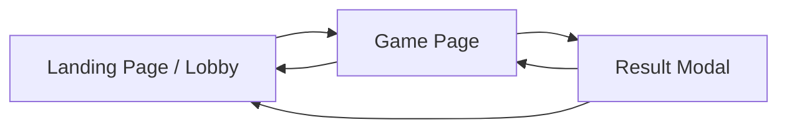

# Software Requirements Specification (SRS)
## Two-Player Games Website

**Version:** 1.0  
**Date:** March 3, 2026  
**Author:** Tanvi Kandoi

---

## 1. Introduction

### 1.1 Purpose
This document specifies the software requirements for a **Two-Player Games Website** — a browser-based platform where two players can play classic board and strategy games against each other on the same device (local multiplayer).

### 1.2 Scope
The website will host a collection of turn-based two-player games. Players take turns on the same screen. The platform will feature a polished UI with a game lobby, individual game pages, score tracking, and smooth animations.

### 1.3 Definitions & Acronyms
| Term | Definition |
|------|-----------|
| P1 / P2 | Player 1 / Player 2 |
| Turn | A single move made by one player |
| Round | One complete game from start to finish |
| Lobby | The main landing page listing all available games |

---

## 2. Overall Description

### 2.1 Product Perspective
A standalone, client-side web application that runs entirely in the browser. No backend server or database is required — all game state is managed in-memory on the client side.

### 2.2 User Classes
| User Class | Description |
|-----------|-------------|
| Player 1 | First player, typically makes the opening move |
| Player 2 | Second player, responds to Player 1 |

### 2.3 Operating Environment
- **Platform:** Modern web browsers (Chrome, Firefox, Safari, Edge)
- **Devices:** Desktop & tablet (responsive design)
- **Technology:** HTML, CSS, JavaScript (no frameworks required)

### 2.4 Constraints
- All games are **local multiplayer** (two players, one device)
- No user accounts or authentication
- No network/online multiplayer in v1.0

---

## 3. Games Included

| # | Game | Description | Grid / Board |
|---|------|-------------|-------------|
| 1 | **Tic Tac Toe** | Classic 3×3 grid; get three in a row to win | 3×3 |
| 2 | **Connect Four** | Drop discs into a 7×6 grid; connect four in a row | 7×6 |
| 3 | **Dots and Boxes** | Draw lines between dots; complete boxes to score | 5×5 dots |
| 4 | **Reversi (Othello)** | Flip opponent's discs by flanking them | 8×8 |
| 5 | **Checkers** | Capture all opponent pieces or block all moves | 8×8 |
| 6 | **Battleship** | Guess locations of opponent's hidden ships | Two 10×10 grids |

---

## 4. Functional Requirements

### 4.1 Game Lobby (Home Page)

| ID | Requirement |
|----|-------------|
| FR-01 | Display a grid/card layout of all available games with name, thumbnail, and brief description |
| FR-02 | Clicking a game card navigates to that game's page |
| FR-03 | Show a "How to Play" tooltip or modal for each game |

### 4.2 Common Game Features

| ID | Requirement |
|----|-------------|
| FR-04 | Display whose turn it is (Player 1 / Player 2) with clear visual indicator |
| FR-05 | Validate all moves — prevent illegal moves with visual feedback |
| FR-06 | Detect win, loss, and draw conditions automatically |
| FR-07 | Display a result screen showing the winner or draw |
| FR-08 | Provide a **Restart** button to replay the same game |
| FR-09 | Provide a **Back to Lobby** button to return to the home page |
| FR-10 | Track and display score across rounds (wins for P1, P2, and draws) |
| FR-11 | Provide an **Undo** button to reverse the last move |

### 4.3 Tic Tac Toe

| ID | Requirement |
|----|-------------|
| FR-12 | Render a 3×3 grid; P1 = X, P2 = O |
| FR-13 | Highlight the winning combination on victory |
| FR-14 | Prevent placing on an already occupied cell |

### 4.4 Connect Four

| ID | Requirement |
|----|-------------|
| FR-15 | Render a 7-column, 6-row grid |
| FR-16 | Animate disc dropping to the lowest available row |
| FR-17 | Detect horizontal, vertical, and diagonal four-in-a-row |
| FR-18 | Prevent dropping into a full column |

### 4.5 Dots and Boxes

| ID | Requirement |
|----|-------------|
| FR-19 | Render a grid of dots with clickable edges between them |
| FR-20 | When a player completes a box, mark it with their color and grant an extra turn |
| FR-21 | Game ends when all boxes are filled; highest box count wins |

### 4.6 Reversi (Othello)

| ID | Requirement |
|----|-------------|
| FR-22 | Render an 8×8 board; P1 = Black, P2 = White |
| FR-23 | Highlight valid move positions for the current player |
| FR-24 | Flip captured discs with animation |
| FR-25 | Skip turn automatically if no valid moves exist |
| FR-26 | Game ends when neither player can move; most discs wins |

### 4.7 Checkers

| ID | Requirement |
|----|-------------|
| FR-27 | Render an 8×8 board with 12 pieces per player |
| FR-28 | Support diagonal movement and mandatory captures |
| FR-29 | Promote pieces to Kings when reaching the opposite end |
| FR-30 | Kings can move and capture backwards |
| FR-31 | Game ends when one player has no pieces or no valid moves |

### 4.8 Battleship

| ID | Requirement |
|----|-------------|
| FR-32 | Each player places 5 ships on their 10×10 grid during a setup phase |
| FR-33 | Provide a screen-switch mechanism so opponents cannot see each other's boards |
| FR-34 | Mark hits (red) and misses (white) on the opponent's grid |
| FR-35 | Announce when a ship is sunk |
| FR-36 | Game ends when all of one player's ships are sunk |

---

## 5. Non-Functional Requirements

| ID | Requirement | Target |
|----|-------------|--------|
| NFR-01 | **Performance** — Game interactions respond within 100ms | < 100ms |
| NFR-02 | **Responsive Design** — Usable on screens ≥ 768px wide | Tablet+ |
| NFR-03 | **Accessibility** — Keyboard navigable, sufficient color contrast | WCAG 2.1 AA |
| NFR-04 | **Browser Support** — Latest 2 versions of Chrome, Firefox, Safari, Edge | Cross-browser |
| NFR-05 | **Load Time** — Initial page load under 2 seconds | < 2s |
| NFR-06 | **Animations** — Smooth 60fps animations for game interactions | 60fps |
| NFR-07 | **No External Dependencies** — Runs without a backend server | Static hosting ready |

---

## 6. User Interface Requirements

### 6.1 Design System
- **Theme:** Dark mode with vibrant accent colors (neon highlights)
- **Typography:** Modern sans-serif font (e.g., Inter or Outfit from Google Fonts)
- **Layout:** Card-based lobby, centered game boards, glassmorphism panels
- **Animations:** Hover effects on cards, smooth piece placement, victory celebrations

### 6.2 Screen Flow



### 6.3 Key Screens

| Screen | Description |
|--------|-------------|
| **Lobby** | Grid of game cards with thumbnails, descriptions, and hover effects |
| **Game Board** | Full-screen game with turn indicator, scoreboard, and controls |
| **Result Modal** | Overlay showing winner/draw, scores, and Restart / Lobby buttons |
| **Rules Modal** | Brief animated explanation of game rules |

---

## 7. Technical Architecture

```
game/
├── index.html          # Lobby / Landing page
├── css/
│   └── styles.css      # Global styles & design system
├── js/
│   ├── app.js          # Router & lobby logic
│   ├── utils.js        # Shared utilities (score, undo, turn management)
│   └── games/
│       ├── tic-tac-toe.js
│       ├── connect-four.js
│       ├── dots-and-boxes.js
│       ├── reversi.js
│       ├── checkers.js
│       └── battleship.js
└── assets/
    └── images/         # Game thumbnails & icons
```

### 7.1 Technology Stack
| Layer | Technology |
|-------|-----------|
| Structure | HTML5 |
| Styling | Vanilla CSS3 (custom properties, grid, flexbox) |
| Logic | Vanilla JavaScript (ES6+ modules) |
| Hosting | Any static file server (GitHub Pages, Netlify, etc.) |

---

## 8. Future Enhancements (Out of Scope for v1.0)

- Online multiplayer via WebSockets
- AI opponent (single-player mode)
- User accounts and persistent leaderboards
- Additional games (Chess, Mancala, Go)
- Mobile-optimized touch controls
- Game replay / move history export
- Sound effects and background music

---

## 9. Acceptance Criteria

| Criteria | Condition |
|---------|-----------|
| All 6 games are playable | Two players can complete a full round of each game |
| Turn management works correctly | Invalid moves are blocked; turns alternate properly |
| Win/draw detection is accurate | All end-game conditions are correctly identified |
| Score tracking persists across rounds | Scoreboard updates after each round |
| UI is polished and responsive | Looks great on screens ≥ 768px |
| No console errors during gameplay | Clean browser console |
| Page loads in under 2 seconds | Tested on standard broadband |

---

*End of SRS Document*
